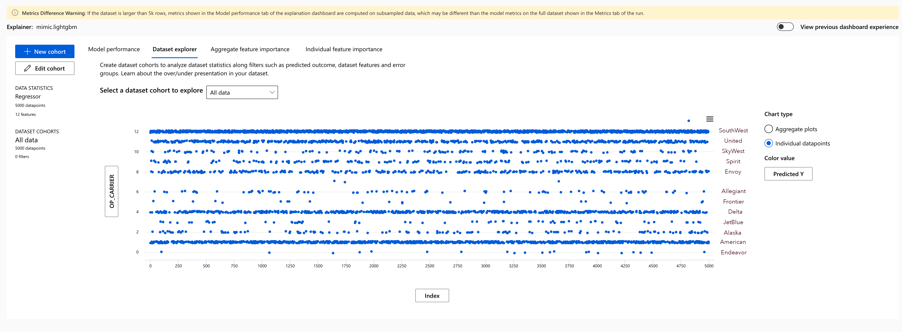
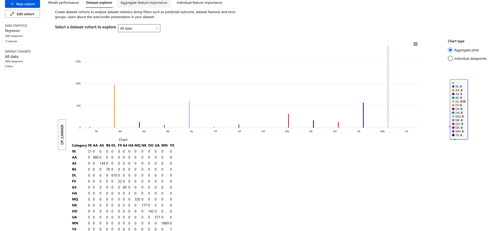
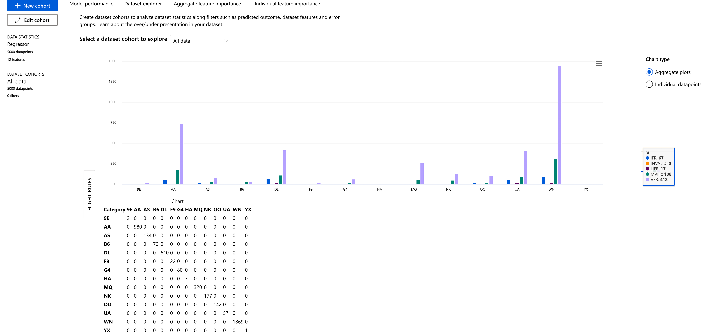
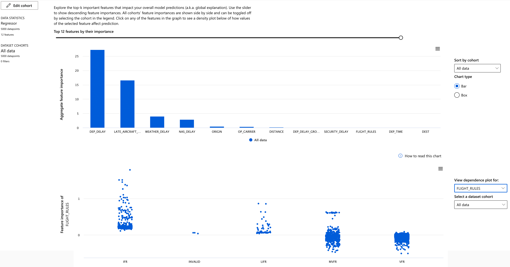
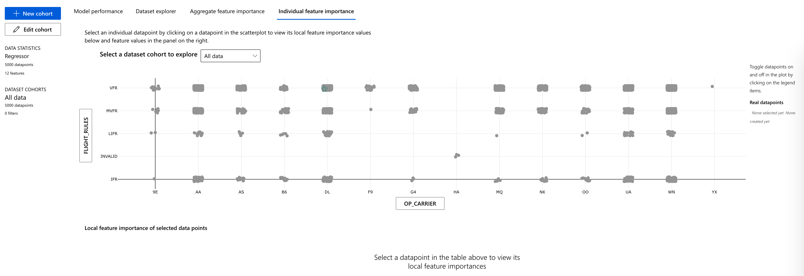

# CuratedFlights

These are files and scripts to support OPTION A for the project.

This is what is here:

- Python scripts:
    - `iem_query.py` - used to grab historical weather data
    - `flightaware.py` - uses the (NOT FREE) Flightaware API to grab future flights for an airport.
    - `make_city_tz_table.py` - create a city/timezone lookup table to convert local flight times to UTC
    - `review_weather_from_db.py` - just a demo to show how to directly query db or use pandas
    - `test_sky_conditions.py` - testing the output of python-metar - ended up just using IEM data directly
    - `weather_csv_to_db.py` - takes historical weather data and saves it to a sqlite database
- Data:
    - DL_SelectFields (june to august 2023) - BTS data from these months
    - L_ CSV files - lookup tables for the BTS data
    - `bts.db` - this is too large to post, but this is the database I am working with in the example(s) above
    - IEM_Outputs - A seperate output file for IEM Metar/Weather data for Flight Category determination
    - `bts_results.csv` - this is the training dataset
    - `XXXX_scheduled_arrivals.csv` - flightaware scheduled arrivals for a given airport. Not ready to be directly inferenced, but would be the source.
    - `KAUS_inferencing_inputs` -  CSV to feed to the endpoint
    - `KAUS_inferencing_outputs` -  CSV for endpoint results (**USE THIS FILE!**)
- Links
    - Links to sources of the data

# STEPS TAKEN

1. Downloaded ontime data for June, July and August 2023 and loaded these records into a SQLite database (a dump of this data can be made vailable, but the number of records is staggering)
2. Filtered for Austin as a destination to obtain 74 unique origins (remove Hawaii)
3. Obtained historical Weather data (from IEM) for these stations
4. Classified flight categories with Python script
5. Developed new training set based on merge between the above
6. Train AutoML Regression
7. Use inferencing dataset from Flightaware for AUS (two days into the future)

# OUTPUTS from Models
Model outputs come from selection the option to have a model explained.  Whereas one model health indicator is given, most of the rest of the outputs are visualizations of model prediction performance.

## Model: R2 predicting CARRIER_DELAY
r2_score is mean squared error normalized by an estimate of variance of data. It's the proportion of variation that can be captured by the model. What's an r2 value? "the proportion of the variation in the dependent variable that is predictable from the independent variable(s)."

[Making sense of R2 scores](https://towardsdatascience.com/interpreting-r%C2%B2-a-narrative-guide-for-the-perplexed-086a9a69c1ec)

### Model Performance
With an R2 (squared) of 0.996, the model tends to explain a reasonable amount of the variance from the sample. 

### Distribution of Observations in the dataset

### Predicted Carrier Delay by Carrier
While SouthWest and American show strongly, this is somewhat a bias favoring their frequency in service to Austin.

### Predicted Carrier Delay by Flight Rules
Most of the value add via sweat equity was from my gathering of origin weather data and developing flight cateogirization of that weather.  This visualization is telling in that it indicates that most carriers have good weather at the origin, making weather an unlikely primary source of delays for Austin.

### Feature Importance by Flight Rules
This analysis is perhaps the most useful as it suggests that departure delays factor most strongly and that bad weather makes things worse.  These are intuitive, but it is nice for observations to validate intuition.  This also says that "mayhem" within the airline's internal operations is perhaps more causal than weather.  For instance, the model is sympathetic to the airline when the weather is bad (seen at the bottom of the visualization), but also says that the airline does not have its act together when the weather is good (VFR and MVFR).

### Feature Importance Carrier by Flight Rules
With this chart, we can see that all are impacted by each flight rule type at the origin airport, but some more than others.  Hawaiian is invalid as I didn't pull weather for Hawaii.

