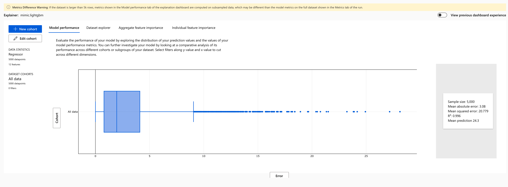

# CuratedFlights

These are files and scripts to support OPTION A for the project.

This is what is here:

- Python scripts:
    - `iem_query.py` - used to grab historical weather data
    - `flightaware.py` - uses the (NOT FREE) Flightaware API to grab future flights for an airport.
    - `make_city_tz_table.py` - create a city/timezone lookup table to convert local flight times to UTC
    - `review_weather_from_db.py` - just a demo to show how to directly query db or use pandas
    - `test_sky_conditions.py` - testing the output of python-metar - ended up just using IEM data directly
    - `weather_csv_to_db.py` - takes historical weather data and saves it to a sqlite database
- Data:
    - DL_SelectFields (june to august 2023) - BTS data from these months
    - L_ CSV files - lookup tables for the BTS data
    - `bts.db` - this is too large to post, but this is the database I am working with in the example(s) above
    - IEM_Outputs - A seperate output file for IEM Metar/Weather data for Flight Category determination
    - `bts_results.csv` - this is the training dataset
    - `XXXX_scheduled_arrivals.csv` - flightaware scheduled arrivals for a given airport. Not ready to be directly inferenced, but would be the source.
    - `KAUS_inferencing_inputs` -  CSV to feed to the endpoint
    - `KAUS_inferencing_outputs` -  CSV for endpoint results (**USE THIS FILE!**)
- Links
    - Links to sources of the data

# STEPS TAKEN

1. Downloaded ontime data for June, July and August 2023 and loaded these records into a SQLite database (a dump of this data can be made vailable, but the number of records is staggering)
2. Filtered for Austin as a destination to obtain 74 unique origins (remove Hawaii)
3. Obtained historical Weather data (from IEM) for these stations
4. Classified flight categories with Python script
5. Developed new training set based on merge between the above
6. Train AutoML Regression
7. Use inferencing dataset from Flightaware for AUS (two days into the future)

# OUTPUTS from Models

## Model: R2 predicting CARRIER_DELAY
r2_score is mean squared error normalized by an estimate of variance of data. It's the proportion of variation that can be captured by the model.

### Model Performance

